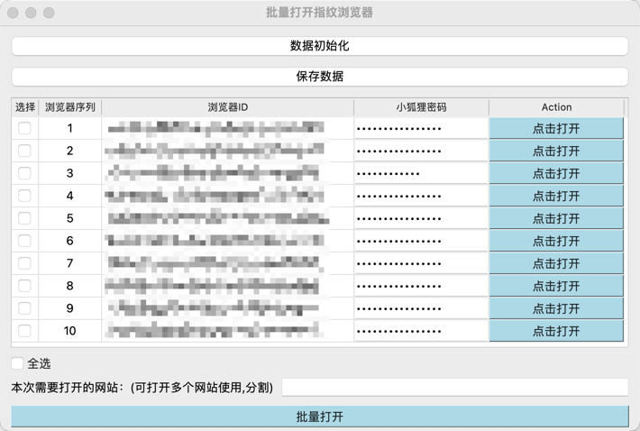

# 批量打开比特浏览器

## 功能
- 批量打开比特浏览器
- 自动输入小狐狸密码
- 自动打开本次所需要进入的页面

## 使用方法
- 首先打开比特浏览器
- 点击数据初始化按钮，会自动获取当前比特浏览器的所有浏览器窗口
- 输入对应浏览器的小狐狸密码，点击打开
- 支持多选，单选
- 可以一次打开多个网页

## 演示

打开程序

点击数据初始化，会获取比特浏览器的所有浏览器信息

输入小狐狸密码

输入需要打开的网址，使用,分割

点击打开即可使用

